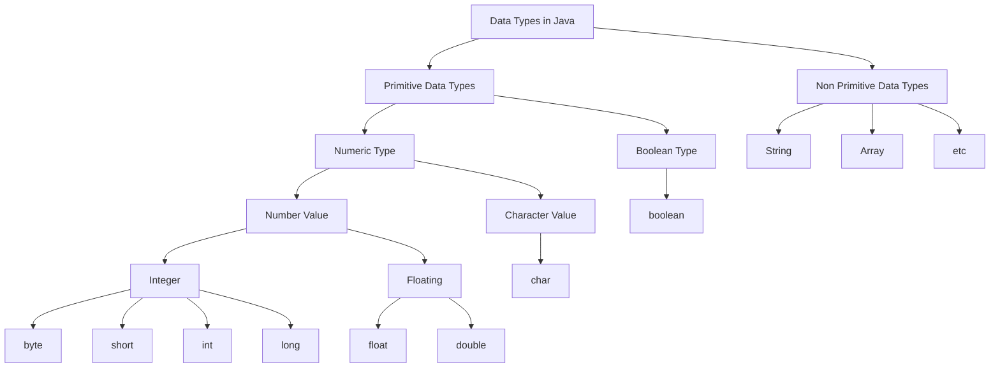

# Datatypes in Java
Data types in Java describe the kind of values a particular variable can hold and the size it occupies in memory. \
There are majorly two types of language that are 
- **Statically Type Language** - Requires declaring the data type of a variable explicitly before assigning a value. The data type remains fixed during compilation. \
e.g. - `java` `c` `c++`.

- **Dynamically Type Language** - Allows variables to hold values of any type, with the type checked during runtime rather than at compile time. \
e.g.  - `javascript` `python`.

Java is Statically Type Language, and there is two types of data-types in java

1. **Primitive Data Types** - The primitive data type is primarily a set of primary data from which other data and data types could be constructed. This consist boolean, char, int, short, byte, long, float, and double. 

2. **Non-Primitve Data Types** - Non-primitive data types in Java rely on objects. They don't store the actual value directly in memory; instead, they hold the memory address where the value is stored. These data types need to be defined by the user.

## Diagram of datatypes in Java



## Types Of Primitive Data Types

|   Type    |   Default Value   | Size  | Range of values|
|-----------|-------------------|-------|-------------------|
| boolean   |   false           | 1 bit | true,false    |
|   byte    |   0               | 8  bits|  -128 to 127  |
|   char    |   \u0000          | 16 bits| 16 bit Unicode Character range from \u0000 (0) to \uffff (65,535)|
|   short   |   0               | 16 bits   | -32,768 to 32767|
|   int     |   0               | 32 bits | -2,147,483,648 $(-2^{31})$ to 2,147,483,647 $(2^{31} - 1)$| 
|   long    |   0               | 64 bits | - 9,223,372,036,854,775,808 $(-2^{63})$ to 9,223,372,036,854,775,807 $(2^{63} - 1)$|
|   float   |   0.0             | 32 bits | Upto 7 Decimal Digits|
|   double  |   0.0             | 64 bits  | Upto 16 Decimal Digits|
----------------------------------------------------------------------------

1. **Boolean Data Type** - 
    - Represents one bit of information.
    - Stores either true or false.
    - Used to track conditions as true or false

    **Syntax** -
    ```java
    boolean isConcentrated = false;
    ```
    **Example** - 
    ```java
    public class BooleanExample{
        public static void main(String[]args){
            boolean isConcentrated = true; // Declare and initialize a boolean variable
            if(isConcentrated){
                System.out.println("You are reading the documentation very carefully"); // Print a message if the variable is true
            }
            else{
                System.out.println("You aren't concentrated"); // Print a message if the variable is false
            }
        }   
    }
    ```
    Think of "if-else" as a two-way street. If something happens, one path is taken. If it doesn't, another path is chosen. We'll explain it more in later articles, but just know they both lead to the right answer. Here if `isConcentrated` is true then `System.out.println("You are reading the documentation very carefully"); ` statement will execute and will give the output and if it is false then `System.out.println("You aren't concentrated");` this block will execute and will give the output.

    **Output** -
    ```
    You are reading the documentation very carefully
    ```
2. **Byte Data Type** - 
    - 8-bit Integer.
    - Value range: -128 to 127.
    - Helps save memory, 4 times smaller than integer type.

    **Syntax** -
    ```java
    byte num = 127;
    ```
    **Example** - 
    ```java
    public class BooleanExample{
        public static void main(String[]args){
            byte num = 127;
            System.out.println(num);
            num++;
            System.out.println(num);
            num++;
            System.out.println(num);
        }   
    }
    ```
    In the provided Java code snippet, a variable named `num` is declared with a data type of `byte` and assigned the value `127`. When `num` is incremented using `num++`, it exceeds the upper limit of the byte data type, which is `127`.

    When a variable reaches its upper limit of the defined data type and is incremented further, it overflows due to the fixed size of the data type. This overflow results in a cycle-like behavior where the value wraps around from the maximum value to the minimum value of the data type.

    So, when num reaches 127 and is incremented (num++), it becomes -128 due to the overflow. Subsequent increments continue the cycle, so the next value is -127.

    **Output** -
    ```
    127
    -128
    -127
    ``` 