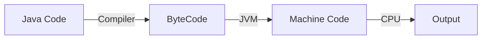
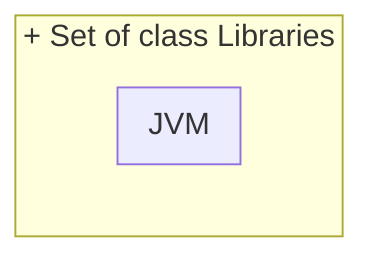
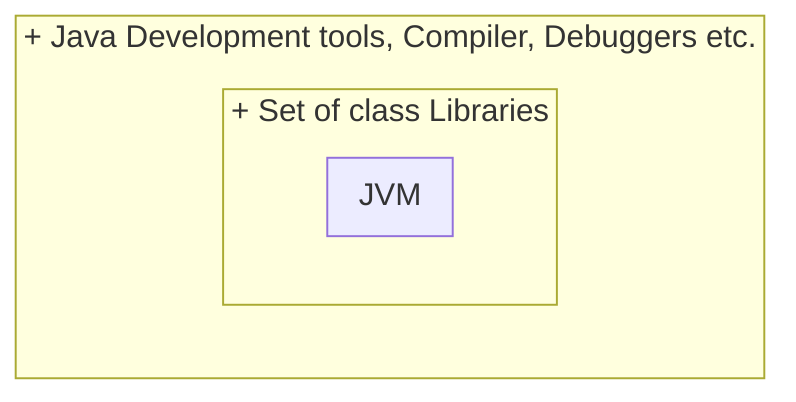

# JVM (Java Virtual Machine)
JVM (Java Virtual Machine) converts Java bytecode to machine-specific code when executing a Java program. It's **platform-independent**, handling core functions like *memory management*, *garbage collection*, and *security*. Customizable via Java options, JVM's virtual interface **isn't** tied to specific hardware or OS, enabling the `write once, run anywhere` `WORA` capability for Java programs.

# JRE (Java Runtime Enviornment)
JRE is the implementation of JVM. It provides a platform to execute java programs. It includes the JVM, Java binaries, and other classes required to run Java applications. JRE does not include any development tools such as a compiler or debugger. 

# JDK (Java Development Kit)
JDK (Java Development Kit) is essential for Java programming, offering tools for compiling, debugging, and running Java programs. It's **platform-specific**, with separate installers for Windows, Mac, and Unix. JDK encompasses JRE (Java Runtime Environment), including a Java compiler, debugger, and core classes. It acts as a superset of JRE, providing additional functionalities for Java development.

### Difference between JDK, JRE

| JDK (Java Development Kit)                        | JRE (Java Runtime Environment)                       |
|-------------------------------------------------- |------------------------------------------------------|
|It is a software development kit that helps in the development of applications in Java. Along with JRE, the JDK includes other various development tools.                                       | It is a software package that provides Java class libraries with JVM. Moreover, it includes other components for running Java applications.     |
|For Java development and compiling applications   | For executing Java applications without development  |
|Compiler, debugger, Javadoc, etc.                 | Java libraries, Java Virtual Machine (JVM), and APIs |
|JDK is the superset of JRE.                        | JRE is the subset of JDK.                        |
|JDK is platform-dependent. For each OS platform (Linux, Windows, Mac, etc.) users are required to install a different JDK.                           | JRE is also platform-dependent, like JDK.                                    |

