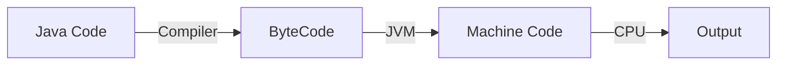
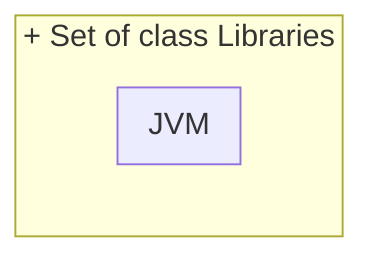
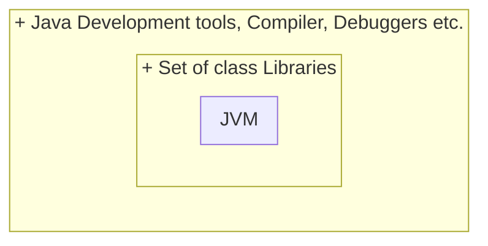

# JVM (Java Virtual Machine)
JVM stands for Java Virtual Machine. When a Java program is executes, JVM is responsible for converting the byte code to the machine-specific code. JVM is also **platform-independent** and provides core java functions such as memory management, garbage collection, security, etc. JVM is customizable and we can use java options to customize it. JVM is called **virtual** because it provides an interface that **does not** depend on the underlying operating system and machine hardware. This independence from hardware and the operating system makes java program write-once-run-anywhere.

# JRE (Java Runtime Enviornment)
JRE is the implementation of JVM. It provides a platform to execute java programs. It includes the JVM, Java binaries, and other classes required to run Java applications. JRE does not include any development tools such as a compiler or debugger. 

# JDK (Java Development Kit)
Java Development Kit (JDK) is the core component of Java Environment and provides all the tools, executables, and binaries required to compile, debug, and execute a Java Program. JDK is a **platform-specific** software and that’s why we have separate installers for Windows, Mac, and Unix systems. We can say that JDK is the superset of JRE since it contains JRE with Java compiler, debugger, and core classes.

### Difference between JDK, JRE

| Feature                  | JDK (Java Development Kit)                        | JRE (Java Runtime Environment)                       |
|--------------------------|---------------------------------------------------|------------------------------------------------------|
| **Contains**             | Development tools, libraries, and executables     | Only runtime environment with libraries and JVM       |
| **Purpose**              | For Java development and compiling applications   | For executing Java applications without development  |
| **Components**           | Compiler, debugger, Javadoc, etc.                 | Java libraries, Java Virtual Machine (JVM), and APIs |
| **Usage**                | Used for Java application development              | Used to run Java applications                         |
| **Includes JRE**         | Yes, JDK includes JRE                             | Standalone package                                    |
| **Can Compile Code**     | Yes                                               | No                                                     |
| **Size**                 | Larger in size due to development tools           | Smaller compared to JDK                               |
| **Required for Development** | Yes                                           | No (if only running Java applications)                |
| **Platform Independence**| Same for all platforms (platform-independent)     | Same for all platforms (platform-independent)         |
