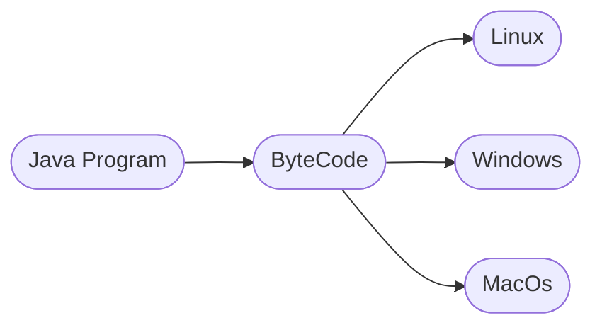

# Features of Java
Java was created with a focus on portability and security. Alongside these core aspects, it incorporates several key features:

1. **Simplicity** - Java offers an uncomplicated and clean syntax, avoiding the complexities of C++ such as pointers and operator overloading.

2.  **Object-Oriented** - Everything in Java is an object, following fundamental OOP concepts like inheritance, polymorphism, and encapsulation.

3. **Robustness** - Emphasizes compile-time and runtime error checking, enhancing memory management and exception handling.

4. **Platform Independence** - Programs compile into bytecode, enabling them to run on any machine with the Java Runtime Environment, ensuring write-once, run-anywhere capability.

5. **Security** - Known for its secure features, running within a controlled environment, reducing system interaction.

6. **Multithreading** - Allows writing programs executing multiple tasks simultaneously, optimizing resource utilization.

7. **Portability** - Java bytecode can function on various platforms without implementation-dependent features.

8. **High Performance** - Although interpreted, Java achieves high performance through its just-in-time compiler.

9. **Distributed Capabilities** - Designed for networked environments, Java provides a library for easy communication using TCP/IP protocols, simplifying network connections compared to C/C++.